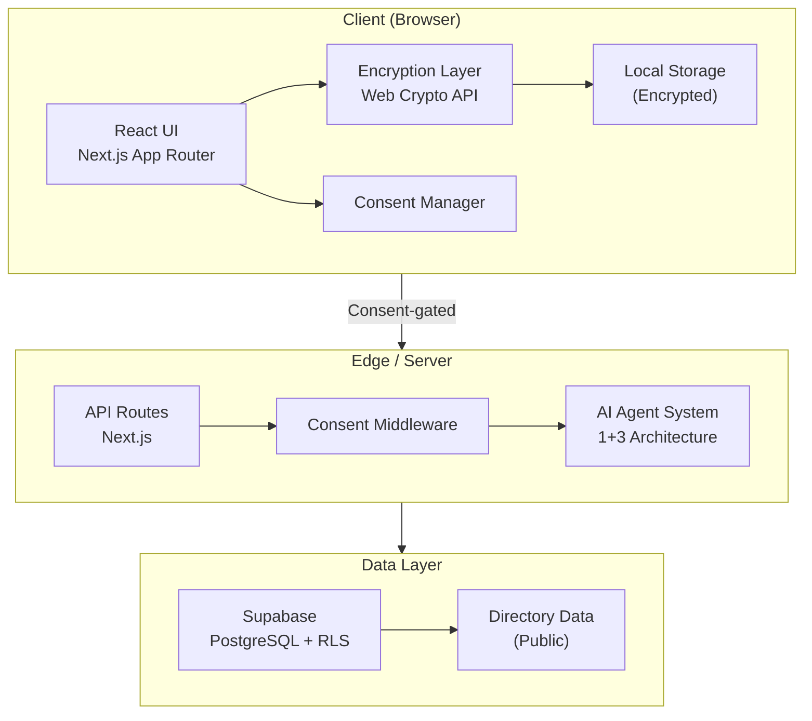
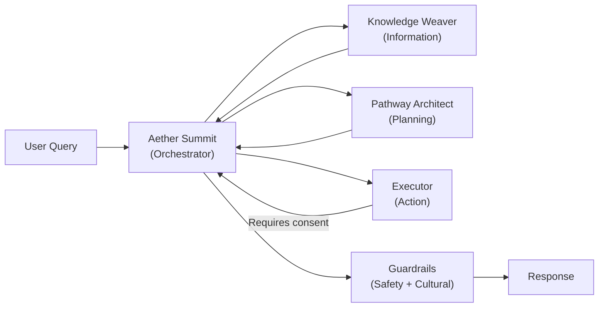

# Architecture

## Overview

**Front_Line_Whanau** is a privacy-first, sovereign digital platform designed to support whānau of preterm twins and families navigating complex frontline services in Aotearoa New Zealand.

The architecture prioritises:

- **Client-side data sovereignty** (encryption at rest)
- **Cultural safety** and alignment with Te Tiriti o Waitangi
- **Modular, maintainable code**
- **Scalable AI agent system**

## Core Principles

- **Privacy by Design**: Sensitive data stays on-device by default (Taonga Vault).
- **Role-Based Experience**: Separate but unified experiences for whānau/parents and practitioners/organisations.
- **Cultural Safety First**: All content and features are reviewed through a Te Ao Māori lens.
- **Progressive Enhancement**: Core functionality works offline/client-side; optional server sync available.

## Technology Stack

| Layer            | Technology                           | Purpose                        |
|------------------|--------------------------------------|--------------------------------|
| Frontend         | Next.js 15 (App Router) + TypeScript | Main application framework     |
| Styling          | Tailwind CSS + shadcn/ui             | UI components                  |
| Desktop          | Tauri 2                              | Cross-platform desktop app     |
| Database & Auth  | Supabase (Postgres + pgvector)       | Data storage, auth, RAG        |
| AI Orchestration | LangGraph                            | Multi-agent workflows          |
| Testing          | Vitest + Playwright                  | Unit + E2E testing             |
| CI/CD            | GitHub Actions                       | Automated testing & deployment |

## High-Level Architecture

---

## 1+3 AI Agent System

### Agent Roles

| Agent                 | Role                                                                     | Consent Required        |
|-----------------------|--------------------------------------------------------------------------|-------------------------|
| **Aether Summit**     | Lead orchestrator — routes queries, maintains context, filters responses | No (orchestration only) |
| **Knowledge Weaver**  | Information retrieval from directory, guides, and NZ statutes            | No (public data)        |
| **Pathway Architect** | Generates personalised support pathways                                  | Yes (`ai.process`)      |
| **Executor**          | Takes action — form pre-fill, document drafts, reminders                 | Yes (`ai.execute`)      |

### Guardrails

- **Grounding**: All responses must cite a source (guide, directory, or statute)
- **Hallucination detection**: Responses are validated against known data
- **Cultural safety**: Te Tiriti principles checked before delivery
- **Trauma-informed**: No pressuring language during high-stress periods

---

## Data Flow

1. **User interacts** with either Parent or Practitioner portal.
2. **Search / Query** goes through the unified directory.
3. **AI Agents** (via LangGraph) enrich results with curated, sourced information.
4. **Sensitive data** is encrypted locally before storage.
5. **Optional sync** to Supabase only happens with explicit user consent.

## Security & Privacy

- All sensitive data is encrypted using Web Crypto API (AES-GCM).
- Keys are derived per user/vault.
- No plaintext sensitive data is sent to servers by default.
- Row Level Security (RLS) is used when Supabase sync is enabled.

## Future Considerations

- Full Tauri desktop integration
- Dual portal UI/UX refinement
- Live LLM inference (behind consent gates)
- Advanced analytics for practitioners (anonymised)
