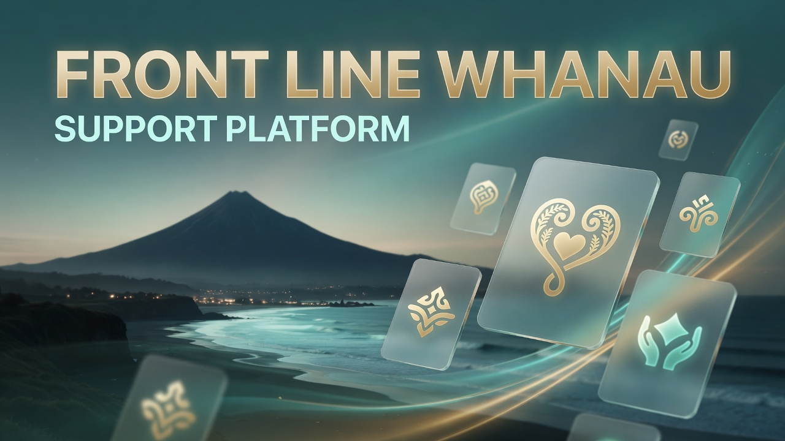
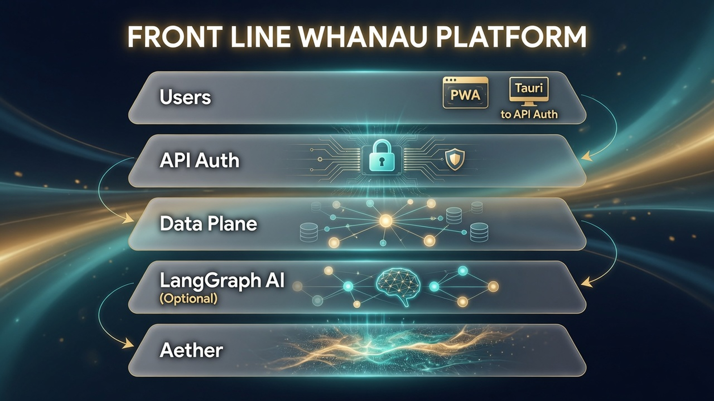
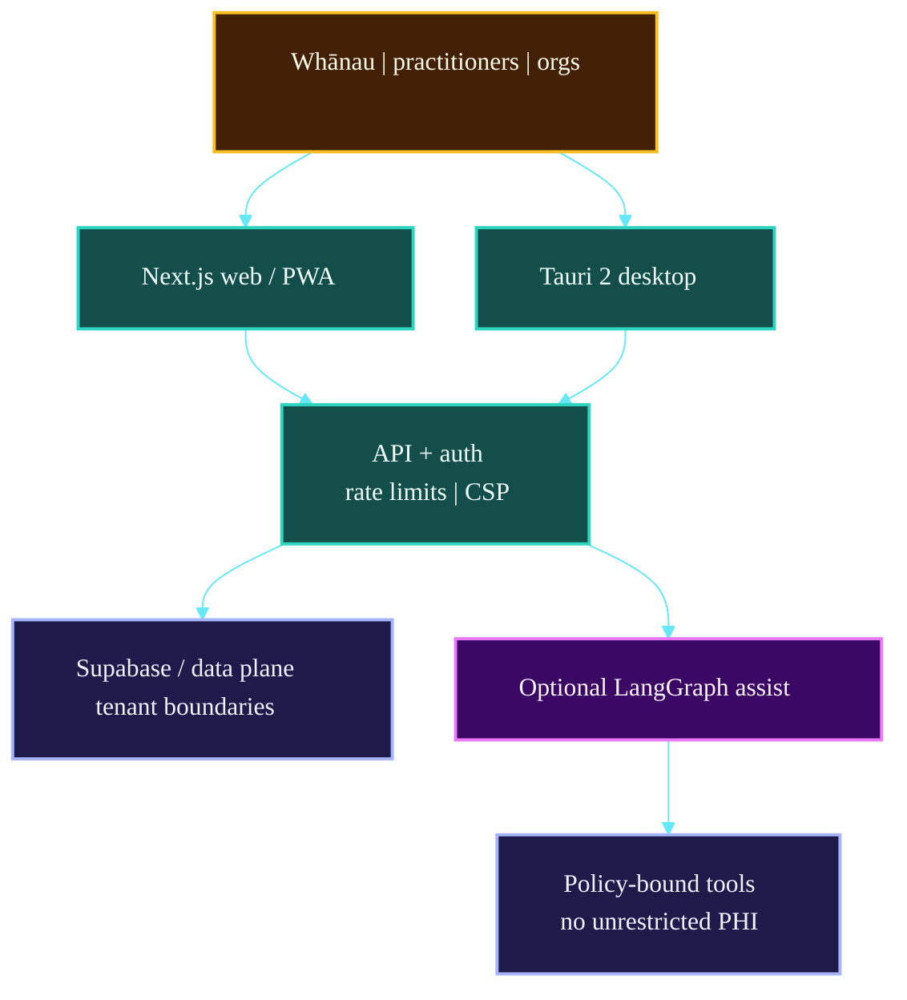

# Front_Line_Whanau

<!-- BEGIN CAT_CONGRUENCE_SNIPPET -->
## Coastal Alpine Tech portfolio

[](https://github.com/fivepanelhat/fivepanelhat)
[](https://github.com/fivepanelhat/fivepanelhat)
[](./.github/agent-fleet/AGENTS.md)
[](https://github.com/fivepanelhat/fivepanelhat)

**Part of the [Kiwi Edge AI Stack](https://github.com/fivepanelhat/fivepanelhat)** | Founder OS: [NZ-Start-Up](https://github.com/fivepanelhat/NZ-Start-Up) | Agent policy: [`.github/agent-fleet/`](./.github/agent-fleet/)

> Sovereign hybrid edge AI for NZ farms and founders - local-first + multi-model, Te Mana Raraunga aligned - collaborating with Venture Taranaki, startups.com investors and Kotahitanga Investment Fund (HITL + cultural advisory for formal approaches).

**Agents inform, draft, prepare, monitor, and remind. Humans advise, sign, file, send, and pay.** 
Anti-hallucination policy: [`.github/agent-fleet/anti-hallucination.md`](./.github/agent-fleet/anti-hallucination.md) | Congruence: [`CAT_CONGRUENCE.md`](./CAT_CONGRUENCE.md)
<!-- END CAT_CONGRUENCE_SNIPPET -->

<!-- BEGIN PROBLEMS_SOLUTIONS_ECONOMY -->
## Problems we are solving

**Front Line Whānau** is the **canonical social / care beachhead** - a national platform for whānau and practitioners navigating preterm and frontline support pathways.

1. **Fragmented support** - Health NZ, trusts, Plunket, iwi providers, and NGOs each hold pieces of the map.
2. **Information overload** - NICU and high-stress journeys bury families in PDFs and phone trees.
3. **Role mismatch** - Parents and practitioners need different tools, not one generic brochure site.
4. **Stale directories** - Organisations struggle to keep listings current without self-service pathways.
5. **Equity gaps** - Māori, Pacific, and rural whānau face navigation and cultural-safety gaps.
6. **Data risk** - Sensitive family information must not default to extractive third-party models.

## Solution we have built

| Built capability | What it does |
| :--- | :--- |
| **Dual portals** | Parent/Whanau and Practitioner/Organisation experiences |
| **National directory** | Searchable services by region, type, and role |
| **Self-service uploads** | Organisations maintain listings; Taonga Vault for sensitive resources |
| **AI-assisted curation** | Draft/prepare research and translation - human moderation |
| **Privacy-first design** | Consent-driven access, client-side encryption patterns, Te Tiriti / Te Mana Raraunga alignment |
| **Delivery** | Web + PWA + Tauri desktop targets |

Live demo path is documented in this README. **Not** mixed into the agritech cold pitch - social care keeps its own GTM and cultural HITL.

### Local (Taranaki) and national (Aotearoa) economic benefits

Coastal Alpine Tech is a **pre-seed** company engineering in **New Plymouth, Taranaki**, with field context in regional primary industries (including Mana Kai-class / Horowhenua agritech). Benefits are framed as **pathways**, not guaranteed job numbers.

#### Local / regional (Taranaki and rural NZ)

| Pathway | What it creates |
| :--- | :--- |
| **R&D and product HQ** | Engineering, product, and IP ownership in region - counterweight to capital-city-only tech |
| **Field install and support** | RPi / Hailo edge nodes, ESP32 sensors, and pilot support need local technicians and partners |
| **EDA leverage** | Tools that help Venture Taranaki-class programmes onboard more founders without linear staff growth |
| **Contractor network** | Legal, cultural advisory, hardware, and pilot ops spend that stays in NZ |

#### National economy and employment

| Pathway | What it creates |
| :--- | :--- |
| **Primary sector competitiveness** | Better yield, compliance, and biosecurity decisions support NZ's export food economy |
| **Onshore data value** | Farm, whānau, and SME operational data stays under NZ custody (Privacy Act + Te Mana Raraunga) |
| **Founder formation** | Faster, cleaner company setup and RDTI-ready logging keeps more early companies investable **in NZ** |
| **Digital capability outside main centres** | Edge AI skills (vision, MQTT, local LLM) transferable across regions |
| **Quality of work** | Human-in-the-loop design preserves skilled human roles in advice, compliance, and care |

#### How this product contributes

See **Solution we have built** above. Cross-portfolio map: [Kiwi Edge AI Stack](https://github.com/fivepanelhat/fivepanelhat) | employment detail: [NZ-Start-Up investor pack](https://github.com/fivepanelhat/NZ-Start-Up/blob/main/docs/INVESTOR_RD_AND_MARKET_REFERENCE.md).

#### Care-sector employment and economy notes

| Pathway | Benefit |
| :--- | :--- |
| **Frontline capacity** | Faster navigation means practitioners spend less time on directory hunting and more on care |
| **NGO / iwi provider efficiency** | Self-service listings reduce duplicate brochure maintenance |
| **Regional equity** | Rural and Māori / Pacific pathways get equal product attention - national cohesion |
| **Digital care skills** | Roles in content moderation, cultural advisory, and support tooling - not automated replacement of clinicians |
<!-- END PROBLEMS_SOLUTIONS_ECONOMY -->



> **Canonical product (2026-07-16 merge):** This repository is the **single** national platform. 
> The legacy scaffold [`whanau-preterm-support-hub`](https://github.com/fivepanelhat/whanau-preterm-support-hub) is redirected/archived. 
> Merge details: [docs/MERGE_FROM_WHANAU_PRETERM_SUPPORT_HUB.md](./docs/MERGE_FROM_WHANAU_PRETERM_SUPPORT_HUB.md) | Status: [REALITY.md](./REALITY.md)

Open-Source National Frontline Whānau Support Platform - Aotearoa New Zealand

A sovereign, privacy-first digital platform designed to support whānau of preterm twins and families navigating complex frontline services across Aotearoa New Zealand.

**Live: https://front-line-whanau.vercel.app**

## Demo

 | Platform | Link | Notes |
 | ---------- | ------ | ------- |
 | **Web** | [front-line-whanau.vercel.app](https://front-line-whanau.vercel.app) | Production deployment (Sydney region) |
 | **Mobile** | Same URL on any phone browser | Tap "Add to Home Screen" to install as a PWA |
 | **Desktop** | `npm run tauri:dev` (local) | Tauri 2 native app Windows (.msi) and Linux (.deb/.AppImage) |

### Quick demo walkthrough

1. Open the web link and choose **I am a Parent / Whānau"**
2. Try the **AI Assistant** (Support page) ask "What is CPAP?"
3. Open the **National Directory** search by region or service type
4. Check **Financial Support Checker** run an eligibility report
5. Open **Whānau Hub** (Resources) explore pathways, timers, and the Taonga Vault
6. Switch to **Practitioner** view via the portal switcher for moderation and feedback tools

## The 5 W's

**Who**
Whānau (parents, caregivers, and extended families), practitioners, doctors, midwives, social workers, and frontline organisations with a strong focus on Māori, Pacific, and rural communities.

**What**
A unified, searchable national platform that brings together information and services from multiple organisations into one place. It features role-based experiences (Parent/Whānau and Practitioner/Organisation portals), self-service uploads, encrypted local storage, and AI-assisted curation.

**Why**
Frontline whānau often face fragmented services, information overload, navigation fatigue, and equity gaps. This platform reduces complexity while prioritising cultural safety and data sovereignty.

**When**
MVP targeted for the next 48 weeks, with ongoing development toward national adoption.

**Where**
Nationwide across Aotearoa New Zealand, available as Web, Desktop (Tauri), and Progressive Web App (PWA).


## Features

- **Dual Portals**: Tailored experiences for whānau/parents and practitioners/organisations
- **Searchable National Directory**: Filter by region, organisation, service type, and role
- **Self-Service Uploads**: Organisations can submit directory listings and securely upload resources (Taonga Vault encryption)
- **Privacy-First Storage**: Client-side encryption (Taonga Vault) with consent-driven access
- **Cultural Safety**: Strong alignment with Te Tiriti o Waitangi and Te Mana Raraunga
- **AI Agent Support**: Specialised agents for research, translation, and curation

## Tech Stack

- **Frontend**: Next.js 15 (App Router) + TypeScript + Tailwind CSS + shadcn/ui
- **Cross-Platform**: Tauri 2 (Desktop) + PWA (Mobile)
- **Backend & Data**: Supabase (Postgres + pgvector + Auth)
- **AI Agents**: LangGraph-powered multi-agent system
- **Testing**: Vitest + Playwright
- **CI/CD**: GitHub Actions

## Architecture Overview

Front Line Whānau is a **sovereign, privacy-first** multi-surface platform (web PWA, Tauri desktop) for whānau and frontline practitioners across Aotearoa, with optional LangGraph AI assist and strong data boundaries.



### System map



 | Layer | Components | Role |
 | :--- | :--- | :--- |
 | **Clients** | Web PWA + Tauri | Mobile & desktop |
 | **API** | Auth | CSP | rate limits | Hardened edge |
 | **Data** | Tenant boundaries | Privacy-first |
 | **AI** | LangGraph optional | Policy-bound assist |

*Full detail: [ARCHITECTURE.md](./ARCHITECTURE.md) | [AI-ARCHITECTURE.md](./AI-ARCHITECTURE.md)*

## Directory Structure

```text
Front_Line_Whanau/
|-- .github/workflows/ # CI/CD pipelines
|-- docs/ # Architecture, roadmap, guides
|-- agents/ # AI agent definitions
|-- src/
| |-- app/ # Next.js routes & pages
| |-- components/ # UI components
| |-- features/ # Domain features (directory, uploads, etc.)
| |-- lib/ # Utilities (encryption, consent, etc.)
| -- ai/ # AI agent logic
|-- supabase/ # Database schema & migrations
-- vitest.config.ts # Test configuration
```

## Requirements

- **Node.js** 22
- npm (or pnpm/yarn)

We recommend using [nvm](https://github.com/nvm-sh/nvm) to manage Node versions.

```bash
nvm use
```

## Getting Started (Development)

### Installation & Run

```bash
git clone https://github.com/fivepanelhat/Front_Line_Whanau.git
cd Front_Line_Whanau
npm install

# 1. Configure environment copy the template and fill in your Supabase keys
# (Supabase Dashboard -> Project Settings -> API). GOOGLE_API_KEY is optional;
# without it the AI agents run in stub mode.
cp .env.example .env.local

# 2. Apply database migrations to your Supabase project
npx supabase login
npx supabase link --project-ref <your-project-ref>
npx supabase db push

# 3. Run
npm run dev
```

The app starts at `http://localhost:3000`. Verify your database connection at `http://localhost:3000/api/health` it should return `{"status":"ok","database":"connected"}`.

### Tauri Desktop Commands

After setup, you can use these commands:

 | Command | Platform | What it does |
 | --------- | ---------- | -------------- |
 | `npm run tauri:dev` | Windows/Linux | Run desktop app in development mode |
 | `npm run tauri:build` | Current OS | Build for current operating system |
 | `npm run tauri:build:windows` | Any | Build Windows installer (.msi) |
 | `npm run tauri:build:linux` | Any | Build Linux AppImage + .deb |

## Security & Privacy

- **Security headers** enforced on all routes via the Next.js 16 proxy (`X-Frame-Options: DENY`, `X-Content-Type-Options`, `Referrer-Policy`, baseline CSP)
- **Health check** at `/api/health` (verifies live database connectivity)
- **Privacy-by-design approach** no PHI stored without explicit consent

## Testing & Quality

 | Check | Status | Command |
 | -------------------------- | --------------------- | ---------------------------------- |
 | TypeScript | [OK] Passing | `npm run type-check` |
 | ESLint | [OK] Passing | `npm run lint` |
 | Unit Tests + Coverage | [OK] 94.95% | `npm run test:coverage` |
 | E2E Tests (Playwright) | [OK] **40/40 passing** | `npm run e2e` |

### Running Tests

```bash
# Recommended before committing
npm run type-check && npm run lint && npm run test:coverage && npm run e2e

# E2E with visual debugger
npm run e2e:ui
```

## License

This project is licensed under the **Apache License 2.0**. See [LICENSE](./LICENSE).

---

## Project badges

Status badges for this repository (CI, security, license, and stack metadata):

[](LICENSE)
[]()
[]()
[]()
[]()
[]()
[](https://github.com/fivepanelhat/Front_Line_Whanau/actions/workflows/ci.yml)
[]()
[]()
