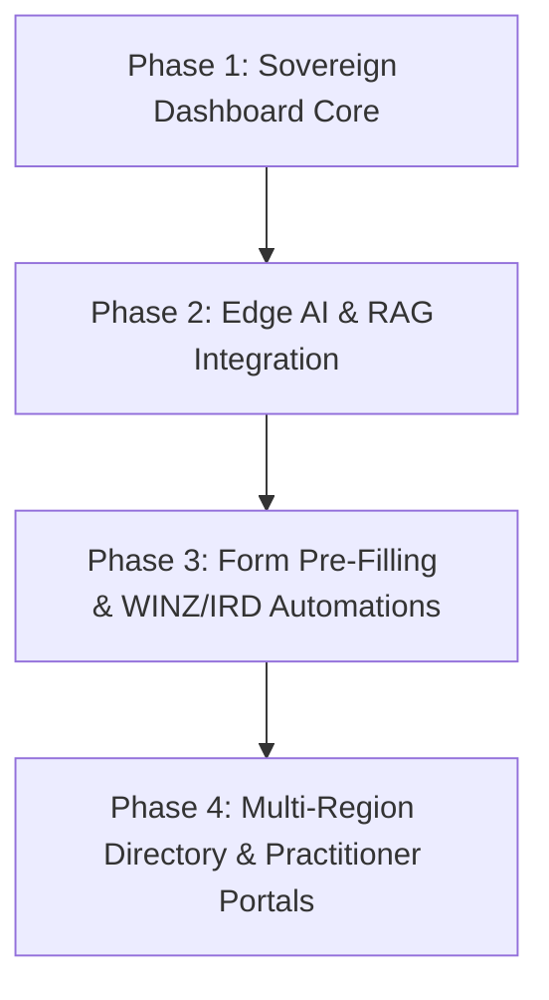

# Front Line Whānau — Development Roadmap & TODO

This document tracks the current status and future milestones for the **Front Line Families Support Hub NZ** platform.

---

## 📋 Roadmap Overview

---

## 🛠️ Task Checklist

### Phase 1: Sovereign Dashboard Core (Completed)
- [x] Create a client-side Hub Dashboard with tabbed navigation.
- [x] Integrate Pathways Tracker for financial, housing, and mental health aid.
- [x] Build local AES-256-GCM encrypted Private Journal.
- [x] Design Taonga Vault with client-side file encryption.
- [x] Integrate regional services directory (Taranaki + National).
- [x] Ensure strict compliance with Next.js 15 App Router & tailwind compiler.

### Phase 2: Edge AI & RAG Integration (In Progress)
- [ ] Connect the AI Assistant (`AetherSummit` orchestrator) to a local Edge LLM or secure API proxy.
- [ ] Implement client-side Retrieval-Augmented Generation (RAG) using local vector embeddings.
- [ ] Connect standard documentation templates (e.g. WINZ guidelines, Tenancy Act summaries) to `KnowledgeWeaver`.
- [ ] Refine `checkGuardrails` to ensure high cultural safety and trauma-informed responses.

### Phase 3: Form Pre-Filling & WINZ/IRD Automations
- [ ] Implement smart extraction of vault documents for form fields.
- [ ] Create interactive pre-fill forms for the **Preterm Baby Payment** and **Home Help**.
- [ ] Implement secure client-side PDF export of completed forms.
- [ ] Build a private print/share capability for extended whānau coordination.

### Phase 4: Scaling & Practitioner Collaboration
- [ ] Expand services directory to cover all regions of Aotearoa NZ.
- [ ] Design non-invasive, privacy-preserving sharing mechanisms for neonatal practitioners.
- [ ] Conduct external security and cryptographic audits of the client-side AES-256-GCM implementation.
- [ ] Establish formal partnerships with Māori Data Sovereignty working groups (Te Mana Raraunga).
