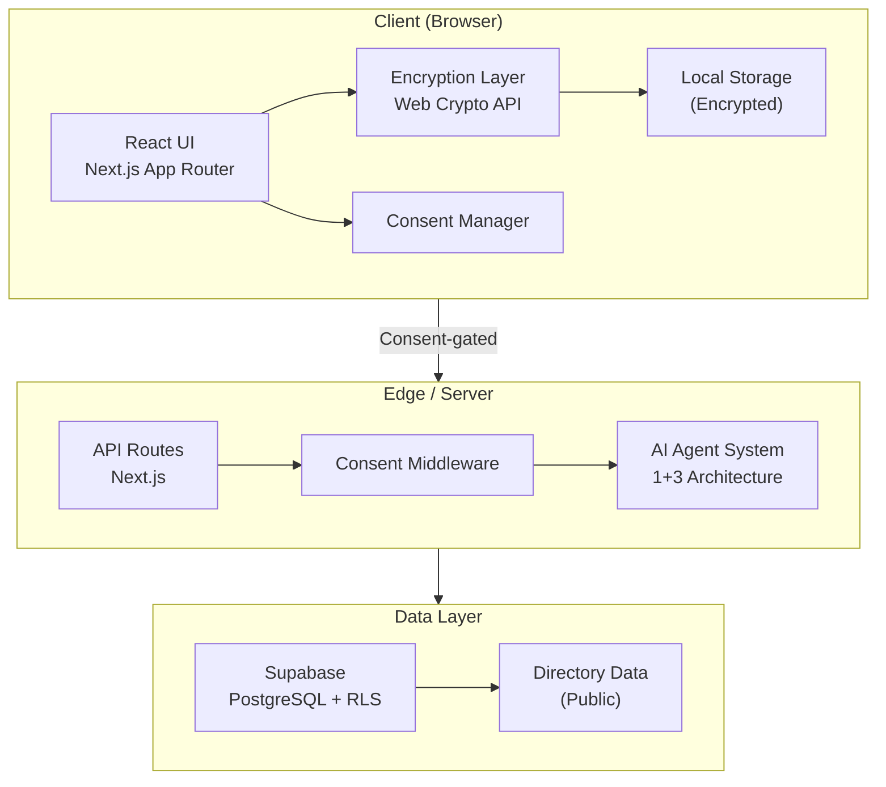
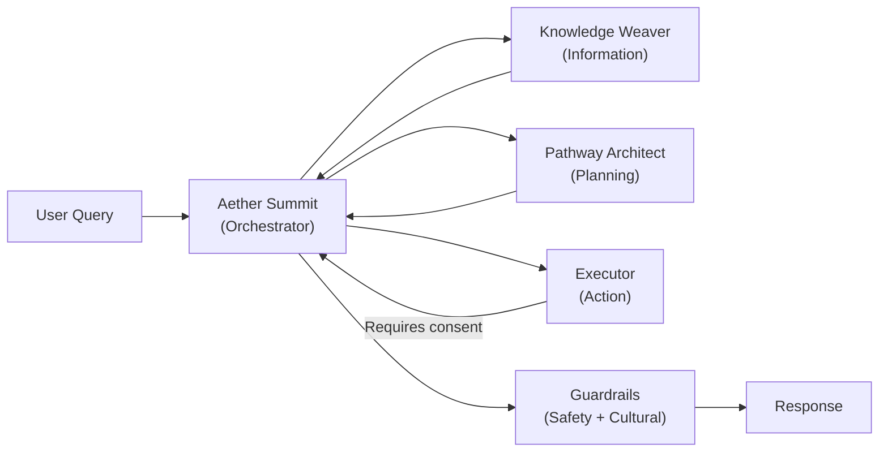
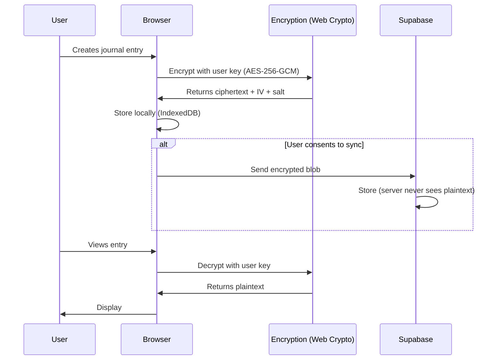
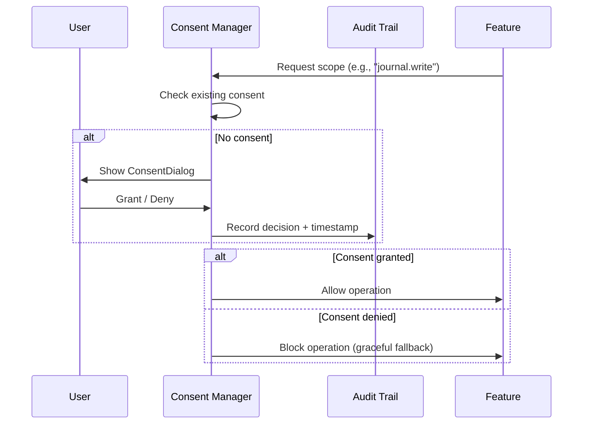

# Architecture — Front Line Families Support Hub NZ

## Overview

The Front Line Families Support Hub NZ is a **sovereign, privacy-first platform** built on **Next.js 15** with the App Router. It follows a **client-side-first** architecture where sensitive data is encrypted before leaving the browser, and server-side processing only occurs with **explicit informed consent**.

---

## System Architecture



---

## 1+3 AI Agent System



### Agent Roles

| Agent | Role | Consent Required |
|-------|------|-----------------|
| **Aether Summit** | Lead orchestrator — routes queries, maintains context, filters responses | No (orchestration only) |
| **Knowledge Weaver** | Information retrieval from directory, guides, and NZ statutes | No (public data) |
| **Pathway Architect** | Generates personalised support pathways | Yes (`ai.process`) |
| **Executor** | Takes action — form pre-fill, document drafts, reminders | Yes (`ai.execute`) |

### Guardrails

- **Grounding**: All responses must cite a source (guide, directory, or statute)
- **Hallucination detection**: Responses are validated against known data
- **Cultural safety**: Te Tiriti principles checked before delivery
- **Trauma-informed**: No pressuring language during high-stress periods

---

## Data Flow

### Encryption Flow



### Consent Flow



---

## Directory Structure

```
src/
├── app/                    # Next.js 15 App Router
│   ├── layout.tsx          # Root layout
│   ├── page.tsx            # Landing page
│   ├── globals.css         # Tailwind + custom layers
│   ├── api/                # API routes
│   │   ├── directory/      # Services directory CRUD
│   │   ├── consent/        # Consent verification
│   │   └── forms/          # Form pre-fill logic
│   ├── dashboard/          # App dashboard
│   ├── journal/            # Mental health journal
│   ├── vault/              # Taonga vault (documents)
│   └── directory/          # Services directory
├── components/             # Reusable UI components
│   ├── ui/                 # Primitives (Button, Card, etc.)
│   ├── Header.tsx
│   ├── Hero.tsx
│   ├── Features.tsx
│   ├── Values.tsx
│   ├── Footer.tsx
│   ├── ConsentDialog.tsx
│   └── ConsentBanner.tsx
├── lib/                    # Core utilities
│   ├── encryption.ts       # Web Crypto API wrappers
│   ├── consent.ts          # Consent manager
│   └── edge-ai.ts          # Edge AI helpers
├── ai/                     # 1+3 Agent System
│   ├── types.ts            # Shared interfaces
│   ├── aether-summit.ts    # Orchestrator
│   ├── knowledge-weaver.ts # Information agent
│   ├── pathway-architect.ts# Planning agent
│   ├── executor.ts         # Action agent
│   └── guardrails.ts       # Safety checks
└── hooks/                  # Custom React hooks
    ├── useConsent.ts
    ├── useEncryptedStorage.ts
    └── useLocalStorage.ts
```

---

## Technology Stack

| Layer | Technology | Rationale |
|-------|-----------|-----------|
| Framework | Next.js 15 (App Router) | Server components, API routes, edge runtime |
| Language | TypeScript (strict) | Type safety for sensitive data handling |
| Styling | Tailwind CSS v3 | Design system tokens, responsive, accessible |
| Database | Supabase (PostgreSQL) | RLS policies, real-time, NZ data residency options |
| ORM | Prisma | Type-safe queries, migrations, seeding |
| Encryption | Web Crypto API | Browser-native, no external dependencies |
| Testing | Vitest + Playwright | Fast unit tests + reliable E2E |
| CI/CD | GitHub Actions → Vercel | Automated quality gates |

---

## Regulatory Compliance

| Regulation | How We Comply |
|-----------|---------------|
| Privacy Act 2020 | Client-side encryption, informed consent, data minimisation |
| Health Information Privacy Code 2020 | Health data never stored in plaintext server-side |
| Oranga Tamariki Act 1989 | Mandatory reporting pathways documented |
| Care of Children Act 2004 | Consent model respects parental/guardian authority |
| Residential Tenancies Act 1986 | Tenancy template guides reference current law |
| Te Mana Raraunga | Māori data sovereignty principles embedded in architecture |
